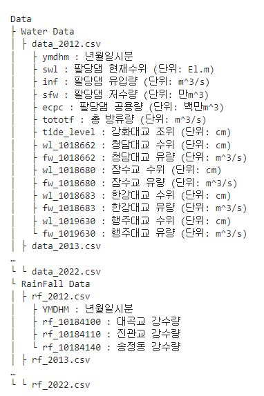
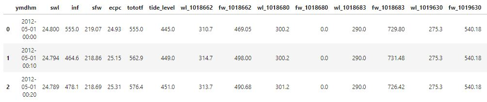
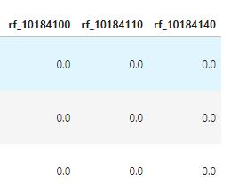

# 팔당댐 홍수 안전운영에 따른 한강 수위예측 AI 경진대회

[DACON](https://dacon.io/competitions/official/235949/overview/description)

선 본 대회의 의도는 추론하고자 하는 기간의 10분 전에, 한강의 주요 지점(다리)에 대한 수위를 예측

- 팔당댐 방류에 따른 서울시내 한강 주요다리 수위예측

### 데이터셋

2012년도부터 2022년 06월까지의 한강 다리 수위 데이터와 지역 3곳의 강수량

- 데이터 목록

- 예시(다리의 수위, 조위 등)

- 예시(지역의 강수량)

 

### 평가지표 : RMSE / R_Squared_Score

### 파일 설명

- 00_데이터분석 : null값 채우기, 통계값, 상관계수 히트맵, 
- 01_baseline : GRU(256), dense(4)
- 02_poly_lasso
- 03_ElasticNet_Lasso_XGBRegressor_랜덤포레스트

### 훈련 결과(Train)

- RandomForest : 
- poly_ElasticNet : 9.09
- PolynomialFeatures + ElasticNet : 8.19
  - alpha를 [0.25, 0.1, 0.01, 0.05]로 조절했으나 비슷한 결과가 나옴
- PolynomialFeatures + lasso : 8.18
  - alpha를 [0.25, 0.1, 0.01, 0.05]로 조절했을 때, 0.1에서 8.18이 나옴
  - 한 변수만 예측하기, 모두 예측하기를 했을 때 모두 예측이 더 낮은 RMSE가 나왔다.

- XGBoostRegressor : 1.28
  - learning rate를 [0.25, 0.2, 0.15]로 조절. 0.25에서 가장 좋은 1.28가 나옴
- PolynomialFeatures + XGBoostRegressor : 1.39
  - learning rate를 [0.25, 0.2, 0.15, 0.125, 0.1]로 조절. 0.1에서 가장 좋은 1.39가 나옴

### 제출 결과(Test)
- RandomForest : 185.62
- lasso : 9.06
- poly_ElasticNet : 9.09
- ElasticNet : 24.04
